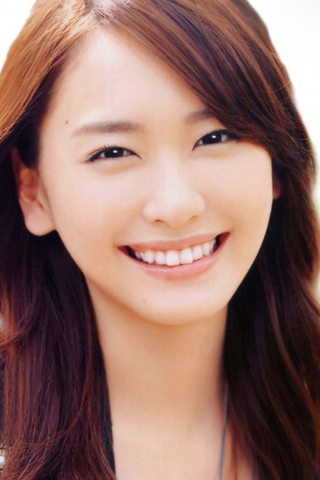

## 调整图片大小、不变形

&nbsp;

 ***
 感谢各位小伙伴对 [<font color=#FF6600> **paperClub** </font>](http://www.infersite.com/)


***

&nbsp;

    通常对于指定大小的图片， 有两种调整方法， 一种是直接暴力调整，是根据指定的高和宽进行缩放调整，另一种是根据指定的高、宽进行padding。  

***


举个例子：

>+ 

&nbsp;

>-上班面这一张图片，高明显要大于宽（高480, 宽320），如何调整为 高宽都是320 像素呢？


>- 方法1： 直接resize: 

```
 python .\img_resize.py -i .\imgs\1.jpg -mh 320 -t 4 -o result/1_4.jpg

```

>- 方法1 结果： 直接把320 * 480 的图片调整为 320 * 320 的图片会变形。


&nbsp;

>- 方法2： padding: 具体原理方法，请参考 [<font color=#FF6600> **paperClub** </font>](http://www.infersite.com/), 网站： http://www.infersite.com

>- 方法2 结果：padding处理后图片没有变形, 是不是很棒呢？

&nbsp;

>- 

```
python .\img_resize.py -i .\imgs\1.jpg -mh 320 -t 5 -o result/1_5.jpg    


```

****

我们在看一个例子：

> 原图：


> 调整为宽-高： 800 * 800


> 调整宽 1200， 高：1000


> 调整宽1200，高自适应：


> 调整高1000，宽自适应：


&nbsp;

 ***
 > 1. 感谢各位小伙伴对 [<font color=#FF6600> **paperClub** </font>](http://www.infersite.com/) 的关注， 您的点赞、鼓励和留言，都是我深夜坚持的一份动力，无论褒贬，都是我们行进途中最好回馈，也都会被认真对待。
 
 > 2. 我们将持续分享各类、好玩且有趣的算法应用及工程和项目，欢迎分享和转发。沟通、学习和交流，请与我联系，虽然平时忙，但留言必回，勿急，感谢理解！
 
 > 3. 分享内容包括开源项目和自研项目，如在引用或使用时，考虑不周、遗漏引用信息或涉及版权等，请您及时联系。如果您对某些内容感兴趣，我们可以一起讨论、交流和学习。


***