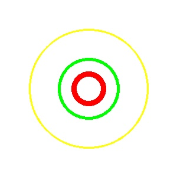
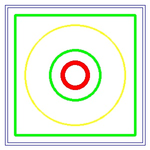
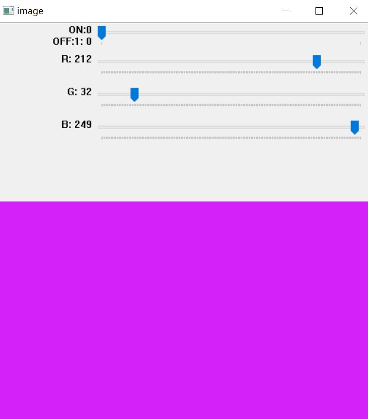
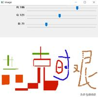
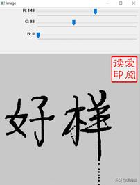

***
#### day02: 从零学AI之图像算法3：使用 opencv 用作绘图板
&nbsp;
***


&nbsp;

主要是 createTrackbar 和 getTrackbarPos的使用，在配合 opencv 一些绘图函数就可以完成简单的绘
图板功能。

&nbsp;
主要使用了opencv gui功能，涉及到了下面几个函数：

***
### 1. cv2.createTrackbar, 创建滑动条: 
***
> 用法： cv2.createTrackbar(trackbarName, windowName, value, count, onChange),
> 参数： trackbar_name  trackbar的名字
        window_name  trackbar父窗口的名字
        函数cvGetTrackbarPos返回指定trackbar的当前位置。
        示例用法：在窗口 “image”上，创建名称为 “R”的轨迹，最小值为0，最大值为255， 回调函数为
        callback（这里回调函数没有起作用，只是起到占位的作用）。
        cv2.createTrackbar('R','image',0, 255, callback) ## 

***
&nbsp;

### 2. cv2.getTrackbarPos, 获取轨迹数值

***
> 用法：cv.getTrackbarPos(trackbarname, winname)
   参数：
        trackbarname:轨迹栏名称
        winname:作为轨迹栏父级的窗口的名称。
        示例：获取轨迹“R”的值，这个值就是滑动条在滑动过程中的数值， r = cv2.getTrackbarPos('R','image')

***
&nbsp;

### 3. cv2.circle, 画圆

>用法： cv2.circle(image, center_coordinates, radius, color, thickness)
参数：
image:它是要在其上绘制圆的图像。
center_coordinates：它是圆的中心坐标。坐标表示为两个值的元组，即(X坐标值，Y坐标值)。
radius:它是圆的半径。
color:它是要绘制的圆的边界线的颜色。对于BGR，我们通过一个元组。例如：(255，0，0)为蓝色。
thickness:它是圆边界线的粗细像素。厚度-1像素将以指定的颜色填充矩形形状。

```
white_img = np.zeros((300,300,3), np.uint8)
white_img[:] = [255,255,255]
cv2.circle(white_img, (150, 150), 100, (0, 255,255), 2) ## 半径 100, 圆环宽2pixel
```
>
***

&nbsp;

#### 4. cv2.rectangle, 绘制矩形：

> cv2.rectangle(img, pt1, pt2, color, thickness, lineType, shift )
参数表示依次为： 
（图片，长方形框左上角坐标, 长方形框右下角坐标， 字体颜色，字体粗细）
在图片img上画长方形，坐标原点是图片左上角，向右为x轴正方向，向下为y轴正方向。左上角（x，y），右下角（x，y） ，颜色(B,G,R), 线的粗细
> lineType: lineType：可以取的值有cv2.LINE_4，cv2.LINE_8，cv2.LINE_AA。其中cv2.LINE_AA的AA表示抗锯齿，线会更平滑。

> ```
> 
> ```




***

&nbsp;

#### 5. 颜色一个简单的绘图板


```
def demo():
    def callback(x):
        pass

    # 创建图像
    img = np.zeros((300, 512, 3), np.uint8)
    cv2.namedWindow('image')  ## 创建窗口image
    switch = 'ON:\nOFF'  ## 开关定义，默认开启（0）

    ## 创建轨迹：
    cv2.createTrackbar(switch, 'image', 0, 1, callback)
    cv2.createTrackbar('R', 'image', 180, 255, callback)
    cv2.createTrackbar('G', 'image', 0, 255, callback)
    cv2.createTrackbar('B', 'image', 0, 255, callback)

    while True:
        cv2.imshow('image', img)
        k = cv2.waitKey(1) & 0xFF ### 监听键盘
        if k == 27:
            break
        ### 获取数值
        r = cv2.getTrackbarPos('R', 'image')
        g = cv2.getTrackbarPos('G', 'image')
        b = cv2.getTrackbarPos('B', 'image')
        s = cv2.getTrackbarPos(switch, 'image')

        ### 判断开关是否关闭
        if s == 0:
            img[:] = [b, g, r]

        else:
            print("绘图功能已关闭")
            img[:] = [255, 255, 255]  ## 转为白色

    cv2.destroyAllWindows()
```

> 

&nbsp
***

### 6.增加绘图功能






&nbsp;

 ***
 ***
 > 1. 感谢各位小伙伴对 [<font color=#FF6600> **paperClub** </font>](http://www.infersite.com/) 的关注， 您的点赞、鼓励和留言，都是我深夜坚持的一份动力，无论褒贬，都是我们行进途中最好回馈，也都会被认真对待。
 
 > 2. 我们将持续分享各类、好玩且有趣的算法应用及工程和项目，欢迎分享和转发。沟通、学习和交流，请与我联系，虽然平时忙，但留言必回，勿急，感谢理解！
 
 > 3. 分享内容包括开源项目和自研项目，如在引用或使用时，考虑不周、遗漏引用信息或涉及版权等，请您及时联系。如果您对某些内容感兴趣，我们可以一起讨论、交流和学习。


***


****

&nbsp
