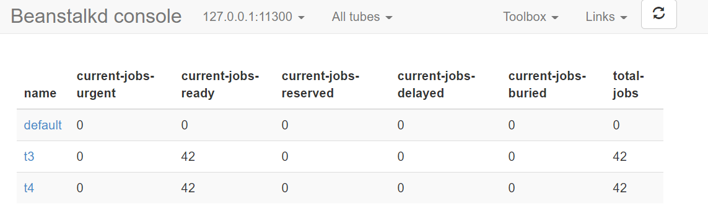
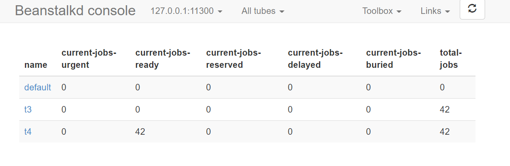

## beanStalk 示例

### 1. beanstalkd 启动
    ./beanstalkd -l 127.0.0.1 -p 11300
   

### 2. beanstalk 服务端

```angular2html
import greenstalk

with greenstalk.Client(address=('127.0.0.1', 11300)) as queue:
	num = 0
	while True:
		num += 1
		text = "第%s个消息" % num
		queue.use('t3')  # 生产者选择tube
		queue.put(text)  # 向tube内打数据
		print(text)
		queue.use('t4')  # 可以再选择一个tube
		queue.put(text * 10)  # 再次打数据
		print(text * 10)
		if num > 20:
			break
```


### 3. beanstalk 消费端

```angular2html
import greenstalk

with greenstalk.Client(address=('127.0.0.1', 11300)) as queue:
	print(queue.using())  # 打印当前tube
	print(queue.stats_tube('t3'))
	queue.watch('t3')  # 选择消费哪个tube
	# queue.watch('t4')
	# queue.use('t3')
	while True:
		job = queue.reserve()  # 此时表示已被消费
		job_id = job.id  # 任务的id
		job_body = job.body  # 任务的信息体
		print(job_id, job_body)
		queue.delete(job_id)  # 消费完了正常就应该删除掉（可以选择不删除）

```

### 4. 可视化


